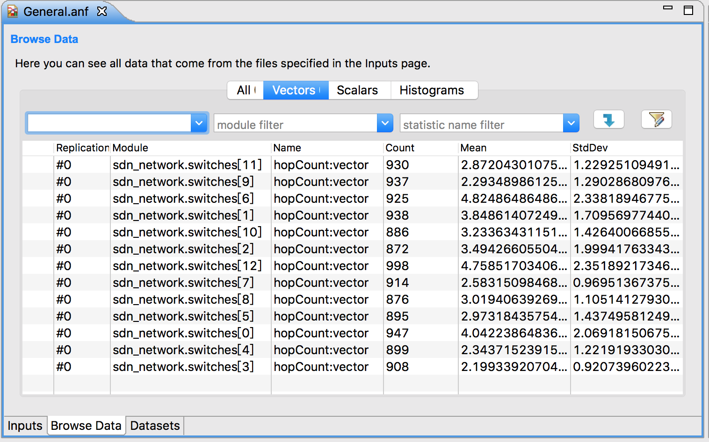

# About this project

This is my first attempt to reproduce the result in academic paper. The paper "QoS-Aware Adaptive Routing in Multi-layer Hierarchical Software Defined Networks: A Reinforcement Learning Approach" designed one hierarchical SDN architecture, and implemented SARSA algorithm on it. 

I used an incremental development approach, and each experiment was developed based on the previous experiment. And there are notes in every experiment which include the `goal`, `implement detail`, `problem`(the problem I encountered during the development) parts. Experiment 6 is the final result of the project.

Because there is no open source header files for hierarchical SDN and I didn't find one existing normal SDN framework on omnet++ platform, I implemented the whole SDN framework by myself. 

# Result

Here is the network topology 

Here is the data analysis returned from the omnet++ platform. 

`Count` means the number of the messages that has been transported to this nodes

`Mean` means the average hops of the route plan

We can see that in this 12-nodes network, the average hop count of the messages transportation is 2~4, which I think is one effective result. 

[Here](https://github.com/qhb1001/SDN-Simulation/blob/master/demo.mp4) is the workflow. The initial message has the source 0, and destination 11. You can see that the super controller runs the SARSA for route planning and it sends the control information to domain controller, which in turn updates the forward table in switches. 

# Area to be improved

The network I designed and the simulation environment are somewhat simple. 

First of all, this network doesn't come from practice or reality. That is to say, I make up this network just for implement the architecture and algorithm. 

Further, the parameters in this network, like bandwidth, queuing time, transmission delay, etc., are just static random numbers for the sake of simplicity. 

And I didn't implement multi-thread for this program, which is very obvious in demo video. 